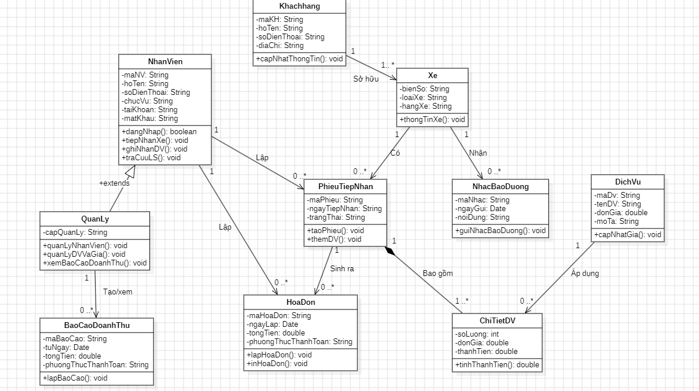

# Hệ thống quản lý cửa hàng bảo dưỡng – sửa chữa xe máy
# Nhóm 15

## 1. Danh sách thành viên

| STT | Họ và tên | MSSV |
|-----|-----------|------|
| 1   | Trần Văn Anh Khoa | 114321 |
| 2   | Trần Công Hậu | 115731 |

## 2. Mô tả yêu cầu

Phần mềm giúp cửa hàng sửa xe máy quản lý việc tiếp nhận xe, dịch vụ đã làm, hóa đơn và doanh thu, thay cho việc ghi sổ tay.

**Người dùng (actor):**
- **Nhân viên:** làm việc hằng ngày ở quầy.
- **Quản lý:** là nhân viên có thêm quyền quản trị.

**Chức năng của Nhân viên:**
- Đăng nhập vào hệ thống.
- Tiếp nhận xe: lưu thông tin khách, thông tin xe và tạo phiếu tiếp nhận.
- Ghi nhận dịch vụ đã làm cho từng xe (thay nhớt, thay lốp, ...).
- Lập hóa đơn và in hóa đơn.
- Tra cứu lịch sử sửa chữa, bảo dưỡng của xe.

**Chức năng thêm của Quản lý:**
- Quản lý nhân viên (thêm, sửa, xóa tài khoản).
- Quản lý dịch vụ và bảng giá.
- Xem báo cáo doanh thu theo khoảng ngày.

**Chức năng tự động của hệ thống:**
- Gửi nhắc bảo dưỡng cho khách khi xe đến hạn.
 
## 3. Hình ảnh class diagram
 

## 4. Mô tả các lớp và quan hệ

| Lớp | Vai trò |
|-----|---------|
| KhachHang | Thông tin chủ xe |
| Xe | Xe máy của khách, nhận diện bằng biển số |
| NhanVien | Người dùng hệ thống, có tài khoản để đăng nhập |
| QuanLy | Kế thừa NhanVien, có thêm quyền quản trị và xem báo cáo |
| PhieuTiepNhan | Mỗi lần xe vào tiệm tạo 1 phiếu |
| DichVu | Danh mục dịch vụ và giá |
| ChiTietDichVu | Từng dòng dịch vụ trong phiếu (số lượng, đơn giá, thành tiền) |
| HoaDon | Thanh toán cho 1 phiếu |
| NhacBaoDuong | Lời nhắc bảo dưỡng gửi cho xe |
| BaoCaoDoanhThu | Báo cáo tổng doanh thu theo khoảng ngày |

| Quan hệ | Ý nghĩa |
|---------|---------|
| KhachHang 1 – 1..* Xe | Một khách có ít nhất 1 xe |
| Xe 1 – 0..* PhieuTiepNhan | Một xe có thể vào tiệm nhiều lần |
| Xe 1 – 0..* NhacBaoDuong | Một xe có thể nhận nhiều lời nhắc |
| NhanVien 1 – 0..* PhieuTiepNhan, HoaDon | Nhân viên lập nhiều phiếu và hóa đơn |
| NhanVien ◁ QuanLy | Quản lý là một loại nhân viên (kế thừa) |
| PhieuTiepNhan 1 ◆– 1..* ChiTietDichVu | Phiếu bao gồm các dòng dịch vụ; xóa phiếu thì xóa luôn các dòng (composition) |
| PhieuTiepNhan 1 – 0..1 HoaDon | Phiếu sinh ra tối đa 1 hóa đơn |
| DichVu 1 – 0..* ChiTietDichVu | Một dịch vụ được áp dụng ở nhiều dòng chi tiết |
| QuanLy 1 – 0..* BaoCaoDoanhThu | Quản lý tạo và xem nhiều báo cáo |

#### 1. KhachHang
Lưu thông tin người chủ xe đến sửa hoặc bảo dưỡng.

| Thành phần | Kiểu | Ý nghĩa |
|-----------|------|---------|
| maKH | String | Mã khách hàng, không trùng nhau |
| hoTen | String | Họ tên khách |
| soDienThoai | String | Số điện thoại để liên lạc và gửi nhắc bảo dưỡng |
| diaChi | String | Địa chỉ khách |
| capNhatThongTin() | void | Sửa thông tin khách khi có thay đổi (đổi số điện thoại, địa chỉ) |

#### 2. Xe
Xe máy của khách, được nhận diện bằng biển số.

| Thành phần | Kiểu | Ý nghĩa |
|-----------|------|---------|
| bienSo | String | Biển số xe, dùng để tìm xe nhanh khi tiếp nhận |
| loaiXe | String | Loại xe (xe số, xe tay ga, ...) |
| hangXe | String | Hãng xe (Honda, Yamaha, ...) |
| thongTinXe() | void | Hiển thị thông tin xe |

#### 3. NhanVien
Người dùng hệ thống ở quầy, có tài khoản để đăng nhập.

| Thành phần | Kiểu | Ý nghĩa |
|-----------|------|---------|
| maNV | String | Mã nhân viên |
| hoTen | String | Họ tên |
| soDienThoai | String | Số điện thoại |
| chucVu | String | Chức vụ (thu ngân, thợ, ...) |
| taiKhoan | String | Tên đăng nhập |
| matKhau | String | Mật khẩu đăng nhập |
| dangNhap() | boolean | Kiểm tra tài khoản và mật khẩu; đúng trả về `true`, sai trả về `false` |
| tiepNhanXe() | void | Nhận xe vào tiệm và tạo phiếu tiếp nhận |
| ghiNhanDichVu() | void | Ghi các dịch vụ đã làm cho xe vào phiếu |
| traCuuLichSu() | void | Xem các lần sửa, bảo dưỡng trước của xe |

#### 4. QuanLy (kế thừa NhanVien)
Quản lý là một loại nhân viên. Lớp này **tự có** mọi thuộc tính và phương thức của NhanVien, chỉ khai báo thêm phần riêng.

| Thành phần | Kiểu | Ý nghĩa |
|-----------|------|---------|
| capQuanLy | String | Cấp bậc quản lý (ví dụ: chủ tiệm, quản lý ca) |
| quanLyNhanVien() | void | Thêm, sửa, xóa tài khoản nhân viên |
| quanLyDichVuVaGia() | void | Thêm dịch vụ mới, chỉnh sửa bảng giá |
| xemBaoCaoDoanhThu() | void | Xem báo cáo doanh thu |

#### 5. PhieuTiepNhan
Mỗi lần xe vào tiệm tạo 1 phiếu. Đây là lớp trung tâm, nối khách, xe, nhân viên, dịch vụ và hóa đơn.

| Thành phần | Kiểu | Ý nghĩa |
|-----------|------|---------|
| maPhieu | String | Mã phiếu |
| ngayTiepNhan | Date | Ngày xe vào tiệm |
| trangThai | String | Tình trạng phiếu (đang sửa, đã xong, đã thanh toán) |
| taoPhieu() | void | Tạo phiếu mới khi nhận xe |
| themDichVu() | void | Thêm 1 dịch vụ vào phiếu (tạo ra 1 ChiTietDichVu) |

#### 6. DichVu
Danh mục các dịch vụ của tiệm và giá chuẩn.

| Thành phần | Kiểu | Ý nghĩa |
|-----------|------|---------|
| maDV | String | Mã dịch vụ |
| tenDichVu | String | Tên dịch vụ (thay nhớt, vá lốp, ...) |
| donGia | double | Giá hiện tại của dịch vụ |
| moTa | String | Mô tả ngắn dịch vụ |
| capNhatGia() | void | Đổi giá dịch vụ |

#### 7. ChiTietDichVu
Một dòng trong phiếu, cho biết xe đã làm dịch vụ nào, bao nhiêu lần, giá bao nhiêu. Lớp này tồn tại để nối PhieuTiepNhan với DichVu, vì một phiếu có nhiều dịch vụ và một dịch vụ nằm trong nhiều phiếu.

| Thành phần | Kiểu | Ý nghĩa |
|-----------|------|---------|
| soLuong | int | Số lượng (số lần hoặc số món) |
| donGia | double | Giá **tại thời điểm làm**. Lưu riêng để sau này DichVu đổi giá thì hóa đơn cũ không bị đổi theo |
| thanhTien | double | Bằng `soLuong × donGia` |
| tinhThanhTien() | double | Tính và trả về thành tiền |

#### 8. HoaDon
Chứng từ thanh toán của một phiếu tiếp nhận.

| Thành phần | Kiểu | Ý nghĩa |
|-----------|------|---------|
| maHD | String | Mã hóa đơn |
| ngayLap | Date | Ngày lập |
| tongTien | double | Tổng các thanhTien của các dòng trong phiếu |
| phuongThucThanhToan | String | Tiền mặt, chuyển khoản, ... |
| lapHoaDon() | void | Tính tổng tiền và lưu hóa đơn |
| inHoaDon() | void | In hóa đơn đưa khách |

#### 9. NhacBaoDuong
Lời nhắc gửi cho khách khi xe đến hạn bảo dưỡng.

| Thành phần | Kiểu | Ý nghĩa |
|-----------|------|---------|
| maNhac | String | Mã lời nhắc |
| ngayGui | Date | Ngày gửi |
| noiDung | String | Nội dung tin nhắn |
| guiNhacBaoDuong() | void | Gửi lời nhắc đến khách (qua số điện thoại) |

#### 10. BaoCaoDoanhThu
Báo cáo tổng tiền thu được trong một khoảng ngày, do Quản lý tạo.

| Thành phần | Kiểu | Ý nghĩa |
|-----------|------|---------|
| maBaoCao | String | Mã báo cáo |
| tuNgay | Date | Ngày bắt đầu tính |
| denNgay | Date | Ngày kết thúc tính |
| tongDoanhThu | double | Tổng tongTien của các hóa đơn trong khoảng ngày |
| lapBaoCao() | void | Cộng các hóa đơn và tạo báo cáo |

